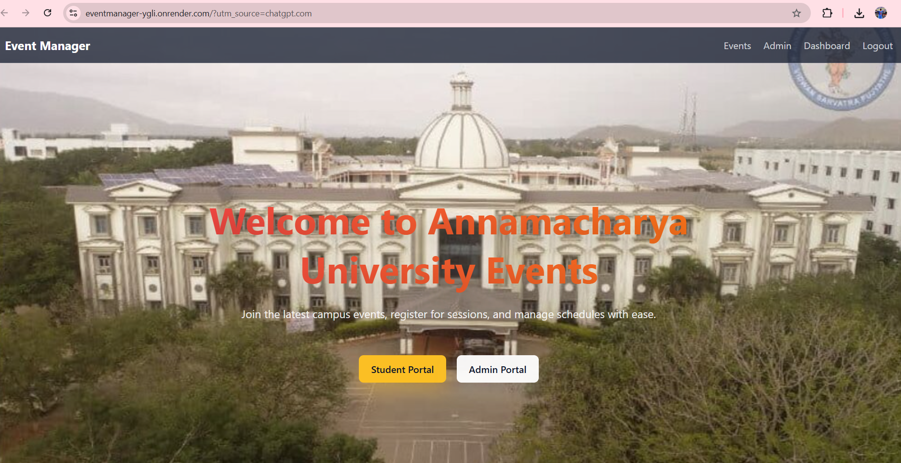
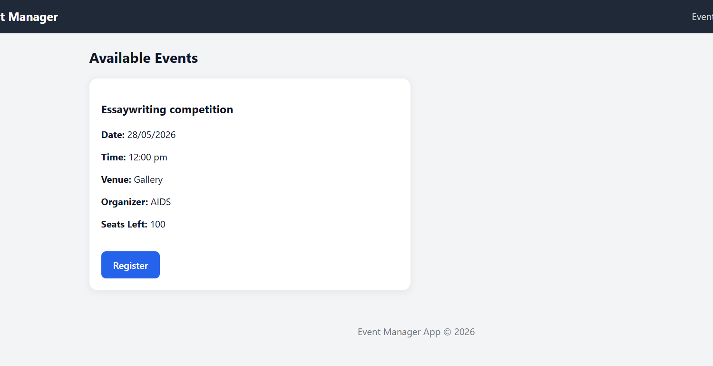
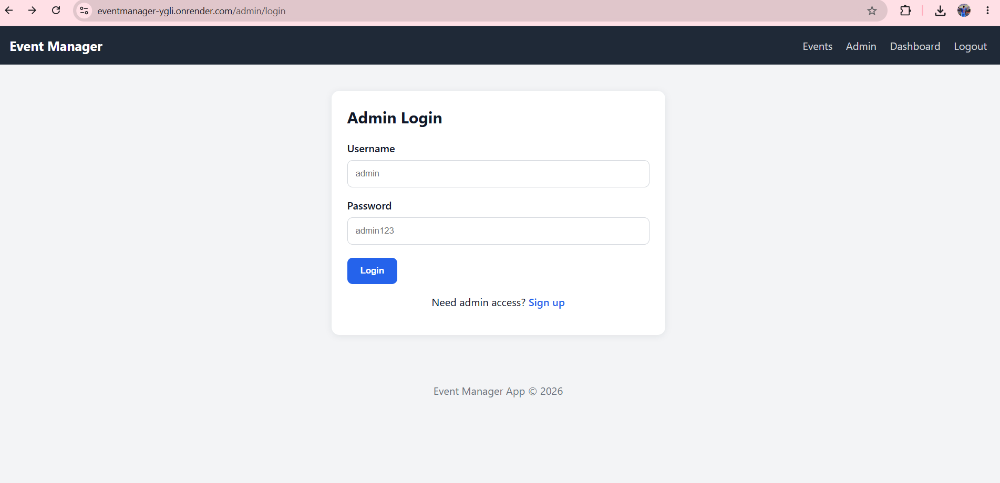
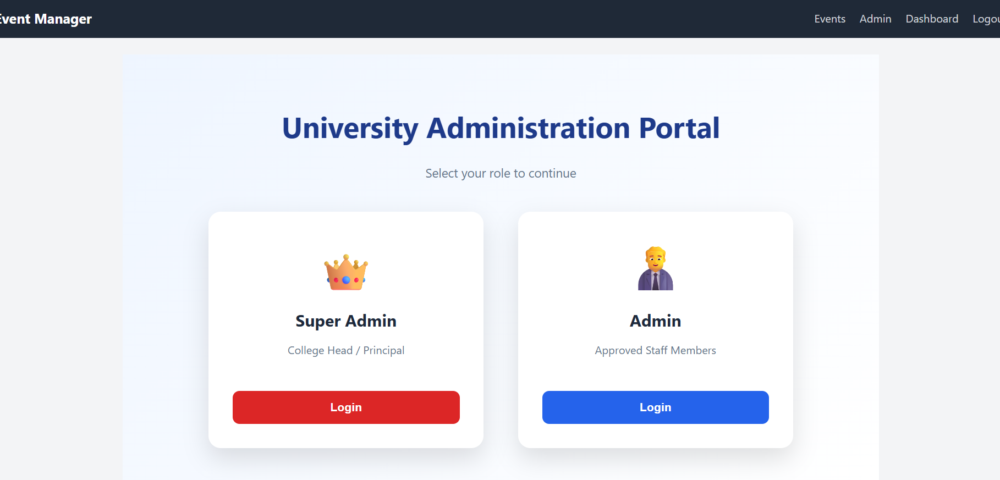
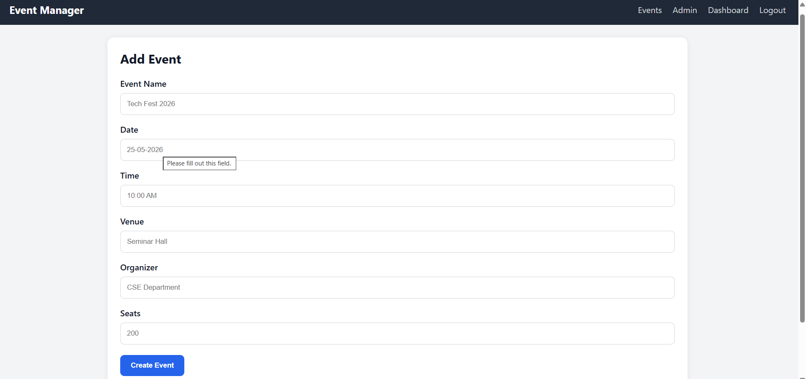
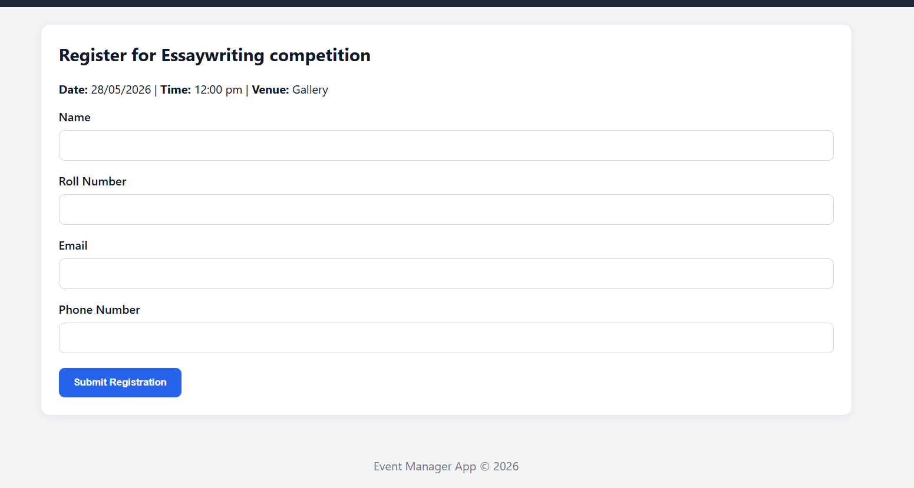
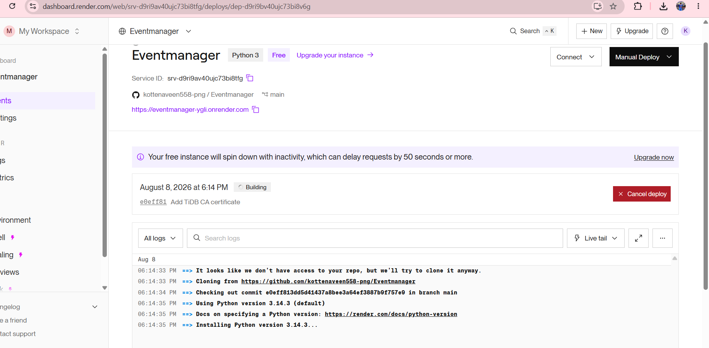

# 🎓 Event Manager App

A full-stack **University Event Management Web Application** built using **Python, Flask, SQLAlchemy, and TiDB Cloud**.

The application allows students to discover and register for university events, while administrators can create, edit, delete, and manage events and registrations.

🌐 **Live Demo:** [Open Live Website](https://eventmanager-ygli.onrender.com)

---

## 📌 Project Overview

The Event Manager App provides a centralized platform for managing university events.

Students can view available events and register by providing their details. Administrators can manage events and monitor student registrations through the administration portal.

The application is deployed on **Render** and uses **TiDB Cloud** as the production database.

---

## ✨ Features

### 👨‍🎓 Student Portal

- View available university events
- View event date, time, venue, organizer, and available seats
- Register for events
- Submit student registration details

### 👨‍💼 Admin Portal

- Admin authentication
- Admin signup
- Create new events
- Edit existing events
- Delete events
- View student registrations
- Track event registrations

### 🔐 Administration

- Separate **Super Admin** and **Admin** workflows
- Staff-based administrator validation
- Password hashing for authentication
- Secure database configuration

---

## 🗄️ Database

The application uses a relational database hosted on **TiDB Cloud**.

### Main Tables

- `admin`
- `event`
- `pending_admin_request`
- `registration`
- `staff_record`
- `student`

---

## 🛠️ Technology Stack

| Technology | Purpose |
|---|---|
| Python | Backend programming |
| Flask | Web framework |
| Flask-SQLAlchemy | Database integration |
| SQLAlchemy | Object-relational mapping |
| PyMySQL | MySQL-compatible database driver |
| TiDB Cloud | Production database |
| HTML | Frontend structure |
| CSS | Styling |
| JavaScript | Client-side functionality |
| Git & GitHub | Version control |
| Render | Cloud deployment |

---

## 🏗️ Application Architecture

```text
                    ┌──────────────────────┐
                    │       Students       │
                    │       Admins         │
                    └──────────┬───────────┘
                               │
                               ▼
                    ┌──────────────────────┐
                    │   Flask Application  │
                    │       Render         │
                    └──────────┬───────────┘
                               │
                         SQLAlchemy
                               │
                               ▼
                    ┌──────────────────────┐
                    │      TiDB Cloud      │
                    │   student_manager    │
                    └──────────────────────┘
```

---

# 📸 Screenshots

## 🏠 Home Page



---

## 📅 Available Events



---

## 👨‍💼 University Administration Portal



---

## 🔐 Admin Login



---

## ➕ Create Event



---

## 📝 Student Event Registration



---

## ☁️ Deployment



The application is deployed and available online through Render.

🌐 **Live Application:** [Open Live Website](https://eventmanager-ygli.onrender.com)

---

## ⚙️ Local Setup

### 1. Clone the repository

```powershell
git clone <YOUR_GITHUB_REPOSITORY_URL>
cd EventManager
```

### 2. Create a virtual environment

```powershell
python -m venv .venv
```

### 3. Activate the virtual environment

```powershell
.\.venv\Scripts\Activate.ps1
```

### 4. Install dependencies

```powershell
pip install -r requirements.txt
```

### 5. Configure environment variables

Create a `.env` file:

```env
DATABASE_URL=your_database_connection_string
SECRET_KEY=your_secret_key
```

> **Important:** Never upload `.env` or database credentials to GitHub.

### 6. Run the application

```powershell
python app.py
```

Open the application at:

```text
http://127.0.0.1:5000
```

---

## ☁️ Deployment

The application is deployed using:

- **Render** — Flask web application hosting
- **TiDB Cloud** — Production database
- **GitHub** — Source code and version control

The production database connection uses environment variables and SSL configuration.

---

## 🔒 Security

- Database credentials are stored using environment variables.
- Secret keys are not committed to the repository.
- Passwords are stored using password hashing.
- Production database connections use SSL.
- Sensitive configuration files are excluded using `.gitignore`.

---

## 📂 Project Structure

```text
EventManager/
│
├── app.py
├── requirements.txt
├── README.md
├── ca.pem
├── Procfile
├── .python-version
├── .gitignore
│
├── templates/
│
├── static/
│
└── screenshots/
    ├── home.png
    ├── student-portal.png
    ├── admin-dashboard.png
    ├── admin-login.png
    ├── create-event.png
    ├── registration.png
    └── render-deployment.png
```

---

## 🎯 Resume Project Description

### Event Manager Web Application | Python, Flask, SQLAlchemy, TiDB Cloud, Render

- Developed a full-stack university event management application using **Flask and SQLAlchemy** with separate student and administrator workflows.
- Implemented **event creation, editing, deletion, student registration, administrator authentication, and registration tracking**.
- Designed and integrated a relational database for managing **students, events, administrators, staff records, and registrations**.
- Deployed the application on **Render** and connected it to a production **TiDB Cloud** database using environment variables and SSL.

---

## 🔗 Project Links

🌐 **Live Demo:** [Open Live Website](https://eventmanager-ygli.onrender.com)

💻 **GitHub Repository:** [View Source Code](https://github.com/kottenaveen558-png/Eventmanager)

---

## 👨‍💻 Author

**Naveen Kumar Reddy**

B.Tech — Computer Science & Engineering (Data Science)